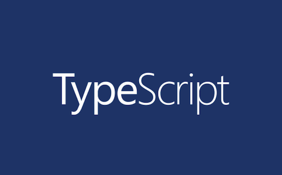

# TypeScript
My works related to TypeScript language.

## Table of Contents
1. [Introduction.](#introduction)
2. [Official references websites.](#references)
3. [GitHub notes.](#github)
4. [GitHub repository calculation.](#calculation)

<a name="introduction"></a>
## 1. Introduction.
 
TypeScript is an open-source programming language developed and maintained by Microsoft. It is a strict syntactical superset of JavaScript, and adds optional static typing to the language.
<br /><br />
TypeScript is designed for development of large applications and transcompiles to JavaScript. As TypeScript is a superset of JavaScript, existing JavaScript programs are also valid TypeScript programs. TypeScript may be used to develop JavaScript applications for both client-side and server-side execution (as with Node.js or Deno). There are multiple options available for transcompilation. Either the default TypeScript Checker can be used, or the Babel compiler can be invoked to convert TypeScript to JavaScript.
<br /><br />
TypeScript supports definition files that can contain type information of existing JavaScript libraries, much like C++ header files can describe the structure of existing object files. This enables other programs to use the values defined in the files as if they were statically typed TypeScript entities. There are third-party header files for popular libraries such as jQuery, MongoDB, and D3.js. TypeScript headers for the Node.js basic modules are also available, allowing development of Node.js programs within TypeScript.
<br /><br />
The TypeScript compiler is itself written in TypeScript and compiled to JavaScript. It is licensed under the Apache License 2.0.
TypeScript is included as a first-class programming language in Microsoft Visual Studio 2013 Update 2 and later, beside C# and other Microsoft languages. An official extension allows Visual Studio 2012 to support TypeScript as well.
<br /><br />
Anders Hejlsberg, lead architect of C# and creator of Delphi and Turbo Pascal, has worked on the development of TypeScript.

<a name="references"></a>
## 2. Official references websites. 
TypeScript official website : http://www.typescriptlang.org <br />

**_TypeScript developers_** <br />
Anders Hejlsberg : https://github.com/ahejlsberg, https://twitter.com/ahejlsberg <br />
Basarat Ali Syed : https://github.com/basarat <br />

<a name="github"></a>
## 4. GitHub notes.
Clone the current GitHub remote repository contents into local machine.
```
$ git clone https://github.com/syakirharis25/TypeScript.git
$ cd TypeScript/
$ git remote -v
$ git status
```

<a name="calculation"></a>
## 5. GitHub repository calculation.
```
draft
```
Refer to : https://github.com/syakirharis25/cloc
